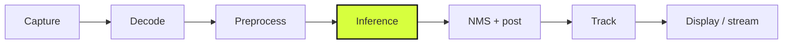

A detector that runs 30 FPS in a benchmark but 6 FPS in your pipeline isn't a 30 FPS detector. Most of the gap is outside the model. Here's how I think about vision inference speed, end to end.

## Profile the pipeline, not the model

Before touching weights, measure where time actually goes. Frame latency is a sum, and every stage bills you:

$$T_{total} = T_{capture} + T_{decode} + T_{pre} + T_{infer} + T_{post} + T_{track}$$

On edge deployments I've repeatedly found inference is under half the budget — video decode and NMS postprocessing eat the rest. Optimize the biggest slice first.

## Export to ONNX and mean it

PyTorch eager mode is a development tool, not a deployment target. Export to ONNX, then:

- Run shape inference and constant folding (`onnx-simplifier` or equivalent).
- Fuse what you can — Conv+BN+ReLU fusion is free accuracy-neutral speed.
- Target the right execution provider: **TensorRT on Jetson/NVIDIA**, **OpenVINO on Intel CPU**, plain ONNX Runtime otherwise. The provider choice routinely matters more than the model choice.

## Quantize with your eyes open

INT8 quantization typically buys 2–4× on supported hardware, but vision models punish careless quantization harder than LLMs do — small-object recall is usually the first casualty. My discipline:

- Always calibrate on **field data**, never on COCO or training samples. Calibration on clean data then deployment on noisy night footage is how you lose 10 points of mAP.
- Keep the detection head in higher precision if INT8-full hurts; mixed precision still captures most of the gain.
- Validate on a held-out field set with per-class recall, not just aggregate mAP.

## Resolution is a dial, not a constant

Input resolution is roughly quadratic in cost ($cost \propto w \cdot h$) and sublinear in accuracy. Dropping 1280 → 960 or 960 → 640 often costs single-digit mAP while nearly doubling FPS. Pick the smallest resolution where your smallest target object is still ~16px across, then stop. For CCTV-style wide scenes, consider tiled inference on regions of interest instead of full-frame 4K.

## Let the tracker do the work

This is the highest-leverage trick in multi-camera systems: **you don't need to detect every frame**. Run the detector at 5–10 FPS and let a tracker (ByteTrack, OC-SORT) interpolate between detections. You get smooth 25–30 FPS tracks at a fraction of the compute, and tracking-by-detection is more stable than frame-by-frame boxes anyway. On our CCTV deployments, detect-every-3rd-frame plus ByteTrack is the default configuration, not an optimization.

## Kill the hidden taxes

- **Decode once**: hardware-decode (NVDEC / QuickSync) and share frames between inference and recording/streaming. Software-decode of multiple 1080p streams will saturate a CPU before the model runs.
- **Batch NMS**: per-class Python-loop NMS is a classic bottleneck. Use batched, vectorized NMS and cap detections per image.
- **Skip stale frames**: if inference lags the stream, drop to the newest frame instead of queueing. A 200ms-old box is worse than no box.

## The checklist

1. Profile end-to-end; fix decode and postprocessing first
2. ONNX export with simplification, right execution provider per device
3. INT8 calibrated on field data, validated per-class
4. Smallest resolution that keeps targets legible
5. Detect sparse, track dense (ByteTrack between detections)
6. Hardware decode, shared frames, no queues

Real-time on the edge isn't about the fastest model — it's about a pipeline with no wasted work.
