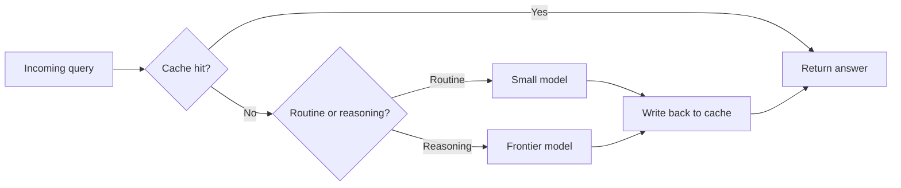

Most LLM inference advice assumes you have an H100 cluster. I usually don't. My systems run where the budget is — constrained servers, edge boxes, cost-sensitive B2B deployments. Here is the shortlist of techniques that actually move the needle, in the order I'd reach for them.

## 1. Quantization first, always

Dropping from FP16 to INT8 or INT4 is the single biggest lever: smaller weights mean less memory bandwidth, and LLM decoding is almost always **memory-bandwidth bound**, not compute bound. In practice:

- **INT8 (smooth-quant style / LLM.int8())** — near-lossless on most models, halves memory.
- **INT4 (AWQ, GPTQ)** — roughly 3–4× smaller, small quality cost. AWQ tends to preserve accuracy better at 4-bit because it protects salient weights.
- **GGUF (Q4_K_M and friends)** — the practical choice for CPU inference with llama.cpp.

Rule of thumb: quantize before you optimize anything else. A 4-bit 70B model on two consumer GPUs will out-serve a 16-bit 13B on one, on both throughput and quality.

## 2. KV-cache is your memory budget

Every concurrent request holds a KV-cache proportional to sequence length. The math is unforgiving:

$$M_{KV} = 2 \cdot L \cdot d_{model} \cdot n_{tokens} \cdot b_{bytes}$$

Two (keys *and* values) times layers times hidden size times tokens times bytes per element. A 70B-class model at FP16 with 8k context holds roughly a gigabyte of cache *per request* — which is why long contexts plus high concurrency is how OOMs happen. Manage it explicitly:

- Cap `max_seq_len` per deployment, not per model default.
- Evict idle sessions aggressively — a chatbot holding 8k tokens of cache for an idle user is throughput theft.
- If your framework supports **paged attention** (vLLM, TensorRT-LLM), use it. It kills cache fragmentation and typically buys 2–4× concurrency at the same memory.

## 3. Continuous batching

Naive servers process one request at a time or wait to fill a batch. **Continuous batching** (vLLM's signature move) inserts new requests into the running batch at every decoding step. Under mixed traffic this alone can multiply throughput several-fold with zero quality impact. If you're still on a naive Hugging Face `generate()` loop in production, this is your upgrade.

## 4. Speculative decoding — free latency

Draft with a small model, verify with the large one. When the draft agrees (which it does surprisingly often on structured output — JSON, code, form-filling), you get multiple tokens per large-model forward pass. Gains of 1.5–2.5× on latency are realistic for exactly the boring enterprise workloads (extraction, classification, templated generation) that dominate real deployments.

<figure>
  
  <figcaption>Fig. 1 — One large-model pass yields five tokens when the draft mostly agrees.</figcaption>
</figure>

## 5. Stop calling the big model for everything

In agentic systems this dwarfs everything above. Route: regex and classifiers for the trivial, a small model for the routine, the frontier model only for genuine reasoning. Cache aggressively — system prompts and few-shot prefixes should be prefix-cached, and repeated queries should hit a semantic cache before they hit the model. I've seen routing plus caching cut inference spend by an order of magnitude on CRM-style workloads.

## The checklist

1. Quantize (INT8 minimum, INT4 where quality allows)
2. Serve with continuous batching (vLLM / TensorRT-LLM / llama.cpp server)
3. Budget the KV-cache; enable paged attention
4. Add speculative decoding for latency-sensitive paths
5. Route and cache so the big model only sees hard problems

Do those five and you've captured the vast majority of available gains — no cluster required.
